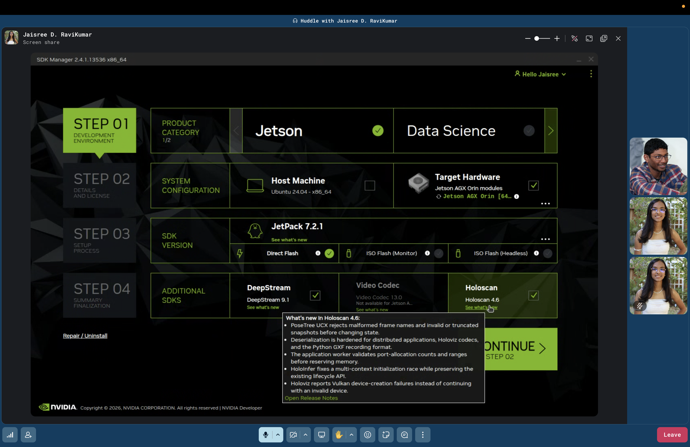
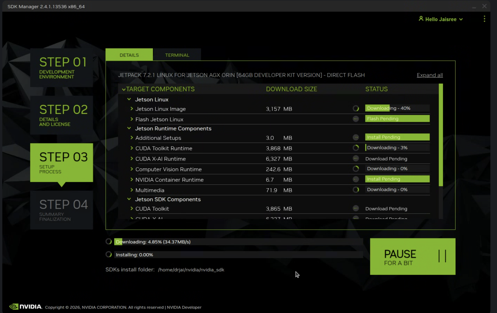
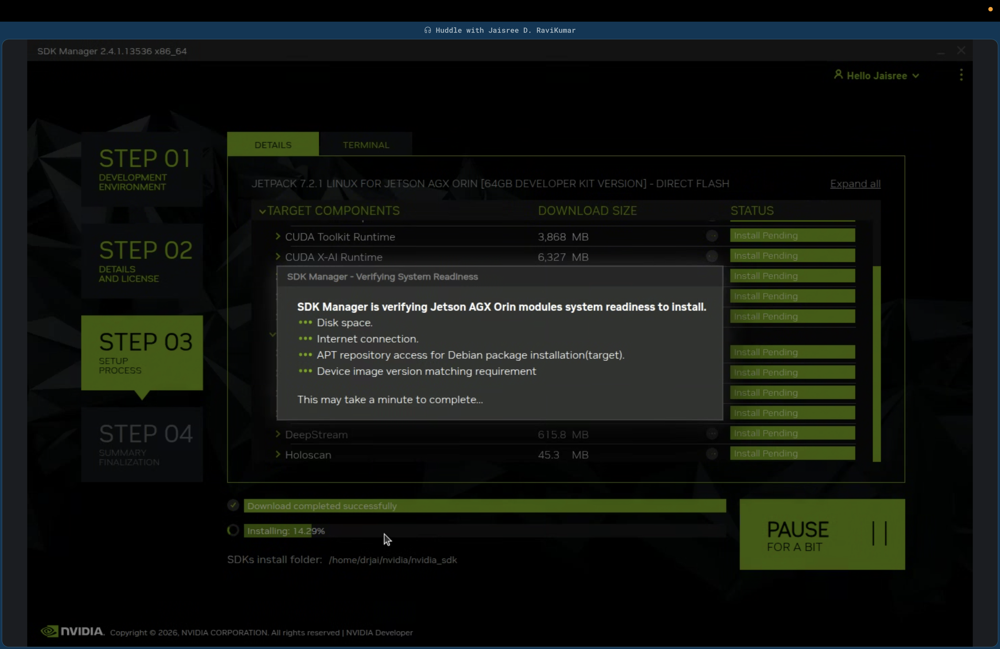
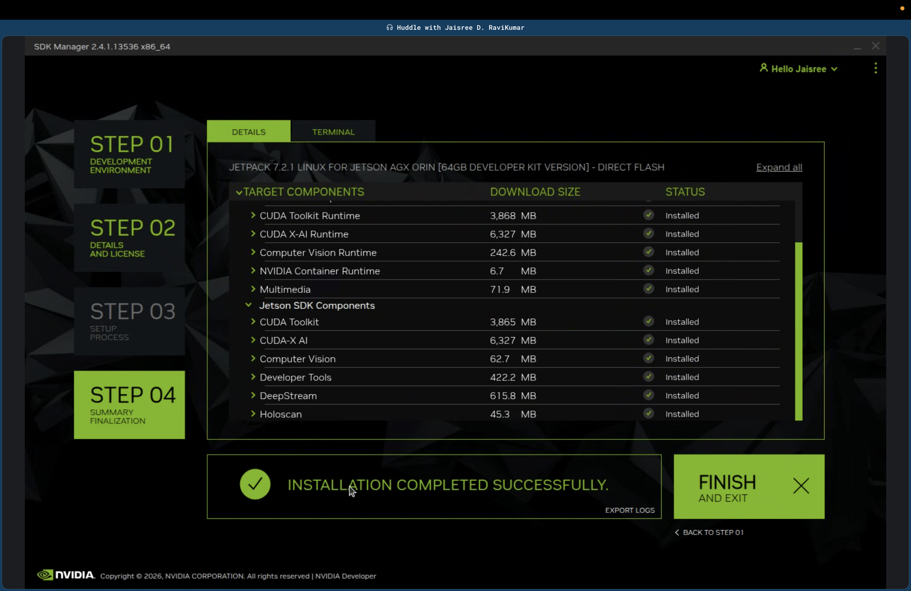

## Disclaimer: If you ask abhi to flash the jetson again, He might shoot you... just kidding... well not really

For more context, visit: [text](https://docs.nvidia.com/sdk-manager/download-run-sdkm/index.html)

Put the jetson in recovery mode first(IMPORTANT!!!), look in the doc above or google how to do that, its just clicking the fucking button

You will need the nvidia sdk manager which is an api that lets you directly download the jetpack sdk: https://developer.nvidia.com/sdk-manager

Install the latest jetpack version, in order to install the correct OS, we need to install the compatible jetpack version.
(In our case it is jetpack 7.2.1, in order to install the ubuntu 24.04 operating system). 

Make sure to be cognitive of where you are flashing the operating system, in our case, it is the NMVE ssd card directly...
## This is what the SDK Manager should look like once installed 

## While it is installing

## This is a good sign

## This is what the current output

## Use the display cord to display the output on a jetson
In terminal type (to check the operating system): cat /etc/nv_tegra_release
In terminal type (to output jetson jetpack version and the tensorrt version): "sudo apt-cache show nvidia-jetpack"

## Things to consider:

Nvidia offers awesome sdk's while along with the jetpack sdk like:
    1)Nvidia's deepstream : https://developer.nvidia.com/deepstream-getting-started
    2)Nvidia's holoscan sdk for telemetry : [text](https://developer.nvidia.com/holoscan-sdk)